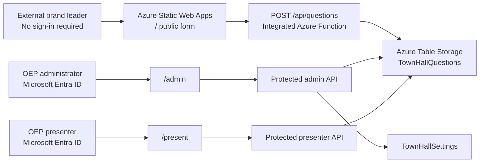

# OEP Anonymous Town Hall Questions

This repository contains a production-ready anonymous question portal for Origin Exterior Partners town halls.

## Architecture Recommendation

Use Azure Static Web Apps with integrated Azure Functions and Azure Table Storage. The public form stays available through a normal HTTPS link with no sign-in. Microsoft Entra ID protects `/admin`, `/present`, and all administrative API routes.



## Assumptions

- External participants should never need an OEP, Microsoft, Teams, SharePoint, guest, or VPN account.
- OEP administrators have Microsoft Entra ID accounts.
- Administrators can provide either an Entra group object ID or a short email allowlist.
- The official OEP logo can replace `frontend/public/logo-placeholder.svg`.

## Azure Resources

- Azure Static Web App, Standard tier recommended
- Integrated Azure Functions API
- Azure Storage Account
- Azure Table Storage tables: `TownHallQuestions` and `TownHallSettings`
- Microsoft Entra ID authentication through Static Web Apps
- GitHub Actions for repeatable deployment

## Setup Effort

Expect about 30 to 60 minutes for the first deployment if the Azure subscription and administrator group already exist. Follow-up events should usually require only changing settings in `/admin`.

## Ongoing Maintenance

Maintenance is intentionally light: review submissions, export CSV files, change town hall wording from `/admin`, and archive or delete data after the event. Dependency updates and Azure cost review should be done periodically.

## Security And Anonymity Limits

The application does not ask for or intentionally store names, emails, Microsoft identities, company, location, IP address, user agent, referrer, cookies, analytics profiles, or browser fingerprints for public submissions. Azure platform security and diagnostic logs may still exist temporarily. Do not describe this as absolute technical anonymity.

## Local Development

Install Node.js 20 or newer.

```powershell
npm install
npm run dev
```

For local API testing without Azure, omit `AZURE_STORAGE_ACCOUNT_NAME`; the API uses in-memory mock storage.

## Deploy

PowerShell:

```powershell
.\scripts\deploy.ps1
```

Bash:

```bash
./scripts/deploy.sh
```

The script provisions Azure resources, creates both tables, builds the frontend and API, deploys to Azure Static Web Apps, and prints:

- Public submission URL
- Administrator URL
- Presenter URL

## Replace The Logo

Replace `frontend/public/logo-placeholder.svg` with the official OEP logo. Keep the same file name or update the `` path in `frontend/src/App.tsx`.

## Change Page Wording

Authorized administrators can update the town hall name, landing-page prompt, success message, and submission open/closed state at `/admin`. No code deployment is required.

## Add Or Remove Administrators

Preferred: add or remove users from the Entra group configured as `ADMIN_ALLOWED_GROUP_ID`.

Fallback: update `ADMIN_ALLOWED_USERS` with a comma-separated list of approved administrator email addresses.

## Export To Excel

In `/admin`, select the download button. The CSV file is named `OEP-Town-Hall-Questions.csv` and opens cleanly in Microsoft Excel.

## Start A New Town Hall

1. Export and retain old records if needed.
2. Archive or delete old table data according to OEP retention requirements.
3. Update the town hall name and wording in `/admin`.
4. Reopen submissions.

## Disable Submissions

Use the `/admin` settings strip and set submissions to `Closed`. Participants will see: "Question submissions are currently closed. Thank you for participating."

## Review Logs

Use the Azure Portal for the Static Web App and associated Functions diagnostics. Keep retention short and avoid logging request bodies.

## Delete Town Hall Data

Delete rows from `TownHallQuestions` after export and retention approval. The table can remain for future events.

## Troubleshooting

- Public form fails: check Static Web Apps deployment status and API app settings.
- Admin access denied: confirm the user is in the configured Entra group or allowlist.
- CSV download denied: confirm the user is authenticated and authorized.
- Storage errors: confirm `AZURE_STORAGE_CONNECTION_STRING`, `TABLE_NAME`, and `SETTINGS_TABLE_NAME`.
